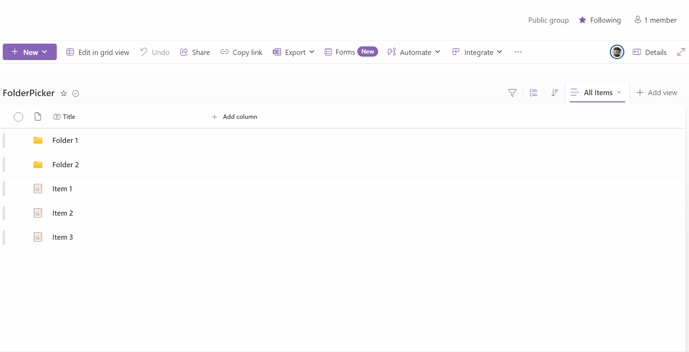

# spfx-panel-folder-picker

## Summary

This is to work out how to get the FolderPicker from SPFX Controls to work in a Panel. At the moment it doesn't render correctly in the Panel.
Put together to raise an issue with the SPFX Controls team.

## Used SharePoint Framework Version

## Solution

| Solution     | Author(s)     |
| ------------ | ------------- |
| FolderPicker | Paul Matthews |

## Version history

| Version | Date          | Comments        |
| ------- | ------------- | --------------- |
| 1.0     | June 12, 2025 | Initial release |

## Disclaimer

**THIS CODE IS PROVIDED _AS IS_ WITHOUT WARRANTY OF ANY KIND, EITHER EXPRESS OR IMPLIED, INCLUDING ANY IMPLIED WARRANTIES OF FITNESS FOR A PARTICULAR PURPOSE, MERCHANTABILITY, OR NON-INFRINGEMENT.**

---

## Minimal Path to Awesome

- Create a SharePoint list,
- Enable Folders
- Create a few Folders and Items in the list
- Clone this repository
- Update [launch.json](.vscode/launch.json) to point to your SharePoint site.
- Ensure that you are at the solution folder
- in the command-line run:
  - **npm install**
  - **gulp serve --nobrowser**
  - **Click Debug - Application Customizer Debug**

## Current Status
When you open the panel, then open the folder picker, it displays the folder picker control. When you click Save on a folder, when folder picker closes, the panel does not display the selected folder in the control. However, the textbox does show the selected folder.

I require help to solve this issue.

Please see the gif Image

